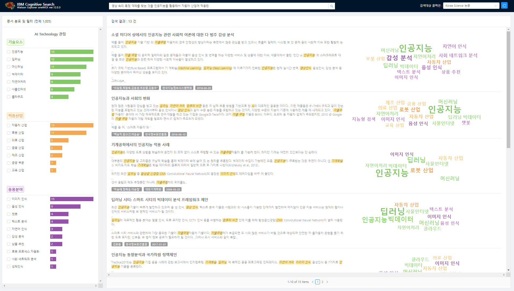

# Cognitive Search
> This is a business intelligence web application that uses the leucine library to search on index results that analyze unstructured/structured data.

[![NPM Version][npm-image]][npm-url]

Developed a Business Intelligence web application for data visualization from end to end(React.js and Node.js). Also, crawled unstructured data of PDF type using Puppeteer.js and preprocessed and refined the data.




## Application's URL
http://klab-cognitive-demo.fyre.ibm.com:8000/


## Code Architecture
* /client
    * /bulid : front-end build file
    * .env : api url for production environment  
    * /src  
       * /action : Redux actions
       * /lib : node express call (proxy node server)
       * /reducer : Redux reducer
       * /component : React components
* /server
     * ecosystem.config.js : set node.js ecosystem   
     * /api : proxy web application server
       * /middleware : authorization
     * /web : proxy web server  
     

## Intallation

Node.js:

```sh
# node -v
v10.16.3
```

PM2:

```sh
# pm2 -v
4.1.2
```


## How to run Node.js Proejct for development environment

```sh
cd client && npm install && npm audit fix
cd ../server/api && npm install && npm audit fix
cd ../web && npm install && npm audit fix
cd ../pm2 start ecosystem.config.js
```


<!-- Markdown link & img dfn's -->
[npm-image]: https://img.shields.io/npm/v/datadog-metrics.svg?style=flat-square
[npm-url]: https://www.npmjs.com/package/npm/v/6.9.0
